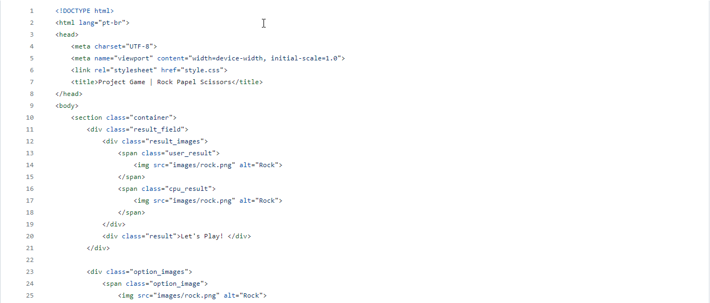
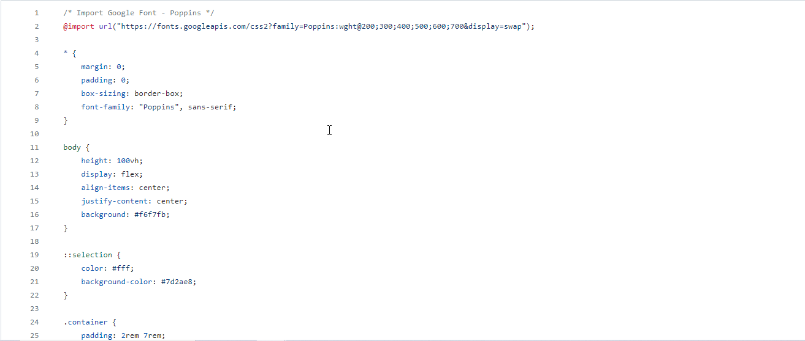

# Papel_Tesoura

Jogo simples utilizando Javascript.

# Readme Contents:

- [Summary](#summary)
  - [About the project](#about)
  - [preview](#preview)
  - [screenshot](#screenshot)
- [My code](#codes)
  - [HTML](#html)
  - [CSS](#css)
  - [Javascript](#js)
- [Process](#process)
  - [Designed](#designed)
  - [Learned](#learned)
- [Autor](#autor)
  - [link](#link)
 
## summary

### about

O intuito do Jogo 

### preview

 

### screenshot

## codes

### html

Code HTML

 

### css

Code CSS

 

### js

Code Js

 

## process

### designed

- Semantic HTML;
- CSS priorities;
- Javascript Game;
- javascript Functions.

### learned

🟢 Javascript Game.  

## autor

